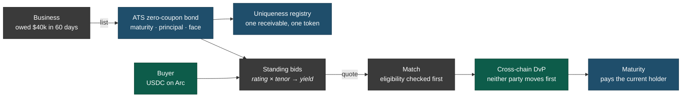
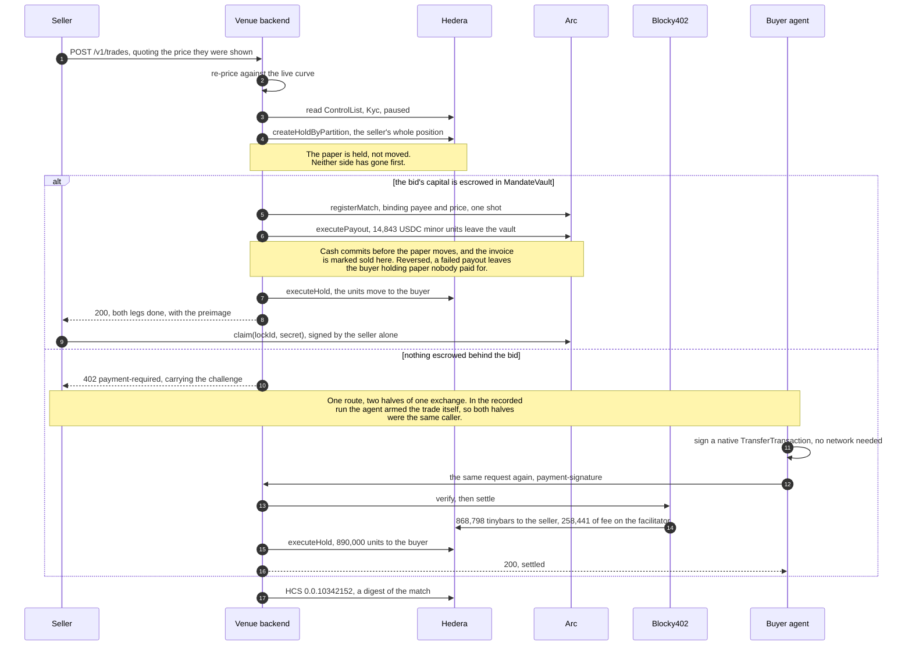
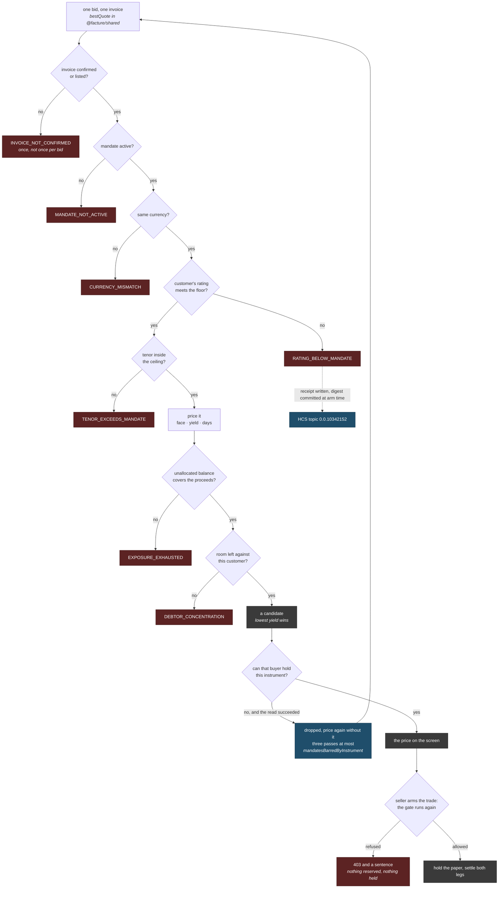

<p align="center">
  <picture>
    <source media="(prefers-color-scheme: dark)" srcset="packages/web/public/logo-dark.svg">
    
  </picture>
</p>

<h1 align="center">Facture</h1>

<p align="center">
  <strong>An invoice is a zero-coupon bond that nobody ever priced.</strong>
</p>

<p align="center">
  Hedera &middot; Arc &middot; ATS zero-coupon paper &middot; cross-chain DvP over x402
</p>

<p align="center">
  <a href="https://github.com/jagnani73/facture/actions/workflows/ci.yml"></a>
  <a href="https://facture-ethonline.vercel.app"></a>
  <a href="https://hashscan.io/testnet/contract/0x8eb9f00126bca50226e47b71a75f7b438e81d408"></a>
  <a href="./LICENSE"></a>
</p>

---

Built for [ETHOnline 2026](https://ethglobal.com/events/ethonline) on the from-scratch track, so no
project-specific code predates the event and the commit history is there to show the work.

|            |                                                                                                                                                                                                                                                                                                                                                                                         |
| ---------- | --------------------------------------------------------------------------------------------------------------------------------------------------------------------------------------------------------------------------------------------------------------------------------------------------------------------------------------------------------------------------------------- |
| **Try it** | [the seller's book](https://facture-ethonline.vercel.app/book) &middot; [standing bids](https://facture-ethonline.vercel.app/mandates) &middot; [a trade proved end to end](https://facture-ethonline.vercel.app/proof/3d129208-a99e-4667-bc4a-1d7bc5a537eb) &middot; [one an agent bought for itself](https://facture-ethonline.vercel.app/proof/c0c8ed97-b01d-4c30-b9b2-0ddf7472fa3d) |
| **Venue**  | <https://facture-backend-4p7y.onrender.com> and [`/health`](https://facture-backend-4p7y.onrender.com/health), which reports each chain as reachable, unreachable, or not yet asked                                                                                                                                                                                                     |
| **Read**   | [four architecture diagrams](./docs/architecture.md) &middot; [every transaction, with ids to check them](./docs/deployments.md) &middot; [a thirteen-minute demo](./docs/demo.md) &middot; [a hands-on walkthrough](./docs/walkthrough.md) &middot; [which parts a model wrote](./docs/ai-usage.md)                                                                                    |

<sub>The venue is a free Render instance and sleeps after fifteen idle minutes, so the first request
after a quiet spell waits about fifty seconds while it wakes. It has no persistent disk either: the
book ships as a snapshot inside the build, and whatever you do to the hosted copy is gone at the
next deploy. A local venue keeps it.</sub>

> **Status: running on testnet.** The five moves below have each happened on chain, more than
> once, for real. A receivable was issued as an ATS zero-coupon bond, priced off a standing mandate,
> checked against the security's own control list, settled delivery-versus-payment, and
> matured — paying its holder par. Addresses, transaction ids and balances either side of each
> of those are in [docs/deployments.md](./docs/deployments.md), which is written so that every
> claim on this page can be checked somewhere that is not us.
> [docs/demo.md](./docs/demo.md) walks the same five moves against the running venue, and
> [docs/ai-usage.md](./docs/ai-usage.md) says which parts a model wrote and which decisions
> were not its to make.
>
> What that does **not** mean: this is a hackathon build on Hedera and Arc testnets, with a
> seeded demo book behind it. The cash leg has two rails — a funded mandate settles out of its
> Arc escrow in USDC, an unfunded one over x402 on Hedera in HBAR under a declared scale — and
> **both have now carried live trades.** Real USDC is escrowed on Arc, deposited by that buyer's
> own wallet, and a sale has been paid out of it and collected by the seller with their own key.
> Where a section describes behaviour the build does not have yet, it says so in place rather
> than leaving you to find out.

Factoring is bond pricing done over the phone. A business that is owed money and needs it now calls
a factor, the factor prices the paper privately, and the business takes 2&ndash;5% off the face value
for the privilege of not waiting. There is no screen, no curve, and no second buyer.

Facture is the market that should exist instead.

## Why this exists

The reason invoice finance never developed a market is not regulation and not custody. It is that
**invoices are not fungible.** Every receivable is a different debtor, a different amount and a
different number of days to maturity, so no two are the same asset. An order book needs something to
book, and there is nothing here that repeats.

So price stays bilateral. It gets negotiated once, in private, by whoever picked up the phone.

The move is to stop trying to standardise the paper and **standardise the bid instead.** A buyer does
not post an offer for one invoice; they post a standing quote over a bucket:

> _Any A-rated paper, 60 days or less, at 12.5% annualised, up to $200k of exposure._

Now the assets stay unique and the **buyers** become fungible. Any receivable that arrives is priced
immediately by reading the curve at its own rating and tenor. Nobody waits for a counterparty,
because the counterparties were already there.

### The instrument was always a bond

This only works if a receivable can be described honestly as a tradeable instrument, and it can. A
discounted invoice is a zero-coupon bond: bought below par, redeeming at face on a fixed date, with
the discount being the yield. That is not a metaphor, it is the same instrument.

Hedera's [Asset Tokenization Studio](https://github.com/hashgraph/asset-tokenization-studio) turns
out to agree. `deployBond` initialises every bond at `rate: 0`, carrying a maturity date, a principal
and a face value redeemed at maturity. The default case in ATS is already a discounted receivable; it
just isn't described that way in the docs.

## How it works

Five moves. The paper lives on Hedera, the money lives on Arc, and neither has to travel.



### List

The receivable is issued as an ATS zero-coupon bond. Maturity is the invoice due date, principal is
the face value.

Alongside it, a uniqueness registry keyed on `hash(debtor, invoice_no, amount)` means one receivable
mints exactly one token, ever. That is the cheap half of the fraud problem and it is worth doing on
day one: selling the same receivable to three financiers is the specific fraud that factoring has
always had, and it is roughly what broke Greensill. A registry does not make an invoice real, but it
stops it being sold twice.

Two things enforce it, and they answer different questions. A unique index on the hash, written in
the same statement that creates the invoice, means there is no check-then-insert window inside this
venue. And [`UniquenessRegistry`](https://hashscan.io/testnet/contract/0x8eb9f00126bca50226e47b71a75f7b438e81d408)
on Hedera is checked before an invoice is listed and claimed once its instrument exists &mdash; which
is the half a database cannot do, because the second financier is a different company, not a second
row in the first one's table. The registry is append-only and has no release, so a non-zero answer is
a permanent public statement that a receivable is spoken for.

That has been tested the only way it means anything: a receivable **this venue has no row for** was
claimed on chain by another instrument, and listing it came back 409. Nothing local could have
refused it.

If the registry cannot be reached, listing proceeds on the index alone. That is a real reduction in
strength rather than a fallback that pretends otherwise, and it is the honest trade against an RPC
outage stopping a business from listing an invoice.

### Quote

Bids are standing, not per-asset. They carry a rating floor, a maximum tenor, an annualised yield and
an exposure ceiling, which is how money-market desks have always quoted short paper. A new invoice is
priced by reading the curve where it sits.

A quote is only worth something if it is firm, which means the capital behind a bid has to be
committed rather than merely permitted. Funding is what does that, and a mandate can only match up
to its unallocated balance &mdash; so overcommitment has a structural answer rather than a patch.
See _Buyers do not browse_ below.

### Match

Eligibility is checked against the security's own `ControlList` and `Kyc` facets **before** matching,
not at settlement.

That ordering is the whole argument. An AMM matches first and discovers the transfer is illegal
afterwards, so a non-compliant trade shows up as a revert. Here an ineligible counterparty is never
matched in the first place, and the refusal is a first-class output rather than a failed transaction.

Every refusal is stored with its reason code and its sentence, and committed to a Hedera Consensus
Service topic &mdash; [`0.0.10342152`](https://hashscan.io/testnet/topic/0.0.10342152) &mdash; so
the refused party can check it without trusting us.

**What goes on the topic is a hash, not the reason.** A refusal names the customer and the amounts,
and a topic is public: publishing it would broadcast one buyer's exposure and one seller's customer
list to anyone reading. So the message carries a SHA-256 commitment and an opaque receipt id. We
hand you your receipt, you hash it the same way, and you check it against the digest recorded at
your sequence number. We cannot later claim we gave you a different reason, and nobody watching the
topic learns anything but that a refusal happened.

Consensus attaches after the receipt is written, so a topic that is unavailable costs the
independently checkable copy and never the answer itself. A refusal is always recorded; it is
checkable wherever consensus was reached.

### Settle

Delivery versus payment across two chains, without a bridge. The bond stays on Hedera, the USDC stays
on Arc, and neither side has to move first.

This reads x402 as a settlement protocol rather than an API paywall: the challenge holds the asset
leg, the payment signature is the cash leg, and the facilitator is what makes the two simultaneous.
Nothing is wrapped and nothing crosses.

The honest reason for two chains is not that it is clever. It is that **buyer capital already lives
where stablecoins live.** You do not ask a treasury desk to bridge onto Hedera to buy a $40k
receivable. DvP means it never has to.

Where the build actually is, in four parts, because they are four different claims.

**The cash leg has two rails, and the mandate decides which.** A bid whose capital is escrowed in
`MandateVault` settles out of it, in USDC on Arc, and `POST /v1/trades` answers `200` with both legs
already done &mdash; **no challenge and no signature, because a funded mandate already said yes to
anything meeting its terms. That is what "firm bid" means.** An unfunded bid gets the x402 exchange
instead. Both answers carry the rail and the reason, so nothing is inferred.

**Nine receivables have sold on chain, and six of them took their payment over x402 on
`hedera:testnet`**, in HBAR, with face value in cents mapped to tinybars 1:1 under a declared scale.
The other three are the paragraph below. The Hedera book's `cashLeg()` returns Arc's chain id and the
vault address as immutables recorded at construction, so the cross-chain link cannot be redirected.

**Three sales have now been paid in USDC on Arc.** `MandateVault` held 5 USDC against one mandate,
deposited by that buyer's own wallet; MF-2061 drew 0.014843 of it, the payout locked in
`DvpEscrow`, and the seller claimed it with their own key &mdash; 0.5 &rarr; 0.512972 USDC, the
difference being the gas they paid, because `claim` checks the caller and the venue cannot collect
for them. MF-2070 drew another 0.012326 and matured; its lock still reads `locked`, because the
seller has not claimed it and `reclaimPayout` is not wired. **MF-2080 went the whole way in one
sitting** &mdash; sold out of the escrow, claimed for 0.017943 USDC net of gas, matured `on_time`,
and paid at par by the collection account, with the mandate book's own verdict on the settlement
response beside the venue's. The venue still refuses to count a
mandate as holding more than the vault does; `balanceOf` is a view, so checking costs nothing.

One consequence worth stating, because it surprised us: **the seller claims their own payout.**
`DvpEscrow.claim` requires `msg.sender == beneficiary`, so a payout lands in an escrow lock rather
than a wallet, and Arc gas is USDC &mdash; a seller holding none can be paid and be unable to
collect.

**One of those x402 payments was made by an agent rather than by a person.** `@facture/agent` read
the book, priced it against its own mandate, armed the trade, signed the cash leg with the buyer's
Hedera key and settled &mdash; trade `c0c8ed97-b01d-4c30-b9b2-0ddf7472fa3d`, cash
`0.0.7162784@1788449867.590233238`, paper `0.0.10311549@1788449868.676674741`, and the match
committed to topic [`0.0.10342152`](https://hashscan.io/testnet/topic/0.0.10342152) at sequence 24.
The buyer paid the 868,798 tinybars it was quoted and nothing else: the entire 258,441 fee was
charged to the facilitator, because the payload's transaction id is generated against the
facilitator's account rather than the payer's. Nothing about the invoice was arranged for it: the
customer is unrated, which loses five of the seven mandates outright, a sixth caps tenor at 45 days
against a 47-day invoice, and the one bid left holds no vault capital &mdash; so the venue routed it
to x402 by its own arithmetic rather than by configuration.

### Mature

The debtor pays and settlement routes to whoever holds the token **now**, not whoever bought it
first.

This is not a lifecycle nicety. Without it the paper cannot legitimately change hands, because a
second buyer would have no way to be paid &mdash; so it is load-bearing for the claim that this is a
secondary market at all.

The mechanism follows from something already decided elsewhere on this page: **the debtor has no
wallet**, because confirmation is a link with one sentence and two buttons and a key to manage would
undo that. So the payout cannot be a transfer the debtor signs. It is drawn instead on a collection
account the venue operates, which is how a factoring house already collects and disburses.

Maturity therefore produces an **obligation, not a payment**. It writes a Hedera Scheduled
Transaction paying face value to the current holder, and leaves it unsigned on the ledger where that
holder can read it. Signing it is a separate act &mdash; the venue's statement that the debtor's
money actually arrived &mdash; and only then does the cash leg become a receipt. The venue cannot
quietly collapse the two, because the account being debited is deliberately not the one that creates
the schedule.

## One book, two lives

Seasoned paper is just shorter-tenor paper, so an invoice sold at 4% on day zero lists into the same
bids on day thirty and clears tighter because less time remains. Primary and secondary run through
one book, and the price moves for a reason anyone can follow.

That is not one market counted twice, and the argument is under _Exit_ below: a buyer bids tighter on
paper they know they can exit, so the secondary leg is what makes the primary quote competitive.
Partial position sales would sharpen the distinction further, being something the primary leg
structurally cannot do &mdash; those are not built, and _Exit_ says where the line falls.

## The product

Nobody using Facture needs to know it is on a blockchain. A seller sees invoices with prices beside
them. A buyer sees mandates, exposure and yield. Every primitive here already has a plain financial
name, so that is the name it is given.

The chains surface in exactly one place: a proof view, one click from any trade, showing the on-chain
receipts, the compliance decision and both settlement legs.

### The book

A seller connects a wallet, or has one made from an email address, and adds their outstanding
invoices: customer, amount, invoice number, due date.

A seller signs in with an email address and Privy makes the wallet; there is nothing to install and
no seed phrase to keep. The venue reads the email out of a signed Privy identity token rather than
out of the request, so what it records is what Privy attested rather than what a caller typed, and a
wallet address once recorded is never rebound by signing in again. Signed out, the screens show a
shared **demo book** &mdash; seeded, with settled trades and matured receivables in it, so the market
can be looked at without an account at all.

Each invoice becomes an instrument at this moment, not at the moment of sale. That ordering matters
more than it looks. Tokenisation happens at onboarding, when nobody is watching a clock, so issuance
is never on the critical path of the moment money moves.

### Confirmation

An invoice is grey until the customer confirms it. The seller requests confirmation and the customer
receives a link carrying one sentence &mdash; _Meridian Fabrication says you owe them $40,000, due 30
November. Is that right?_ &mdash; and two buttons. No wallet, no signup.

This works where most attestation schemes do not, and the reason is behavioural rather than
cryptographic. The debtor is not being asked to vouch for a stranger. They are being asked to
acknowledge their own accounts payable, which costs them nothing and which they have no incentive to
deny.

The invoice turns green. Now it has a price.

### The quote is already there

A confirmed invoice carries a live price. Not a button that requests one: the number is simply
present, and it moves as the curve moves and as the due date approaches.

> **$40,000** &middot; due in 60 days &middot; worth **$39,178** today
> 12.5% annualised &middot; three mandates would take this

This is the product. Every other screen exists to make this screen true. Nothing in invoice finance
works this way today, where a price is a phone call and a wait.

### The sale

Face $40,000, sixty days, 12.5% annualised, discount $821.92, proceeds $39,178.08 &mdash; 2.05% of
face, against the 2&ndash;5% the same seller pays a factoring house today. The customer confirms, the
seller offers it into the book, and it settles in seconds against the best mandate that accepts this
customer, accepts this tenor, and has exposure left. Offering is the seller's own act: a confirmed
invoice is priced, a listed one is for sale, and arming a trade refuses anything that is not
listed.

### Buyers do not browse

A funder never scrolls through invoices deciding one at a time. They write a mandate &mdash; _any
invoice, customer rated A or better, ninety days or less, at 12.5% annualised, up to $200,000 total
and $50,000 per customer_ &mdash; fund it, and walk away.

Funding is what makes the quote firm, which is the answer to what a standing bid actually commits. A
mandate can only match up to its unallocated balance, so overcommitment has a structural answer
rather than a patch.

This is also how credit desks already work. The job is portfolio policy, not deal-by-deal
underwriting. Standing mandates are not a workaround for the absence of an order book; they are the
correct instrument for paper that will never be fungible.

### Exit

On day thirty a holder lists back into the same book and clears tighter, keeping the carry they
earned, or sells half the position and keeps the rest.

The reason this is not decoration: buyers bid tighter on paper they know they can exit. Remove the
secondary leg and every mandate widens, and the seller gets less on day zero. The two markets are not
sequential features. One prices the other.

One half of this is built. A holder can relist seasoned paper into the same book, and it prices off
the same standing bids on its shorter remaining tenor &mdash; `quote-engine.ts` never reads a seller,
so the arithmetic needed no change at all. What made it buildable was finding that the asset leg is
not what it looked like: `createHoldByPartition` acts on the caller's own tokens, so the resale's
hold is signed by whoever holds the paper, and the venue is the escrow exactly as it is on a first
sale. Authorising the venue as an ERC-1400 operator &mdash; the obvious approach, and the one this
project had written down &mdash; would have succeeded and conferred nothing, because the deployed
diamond has no operator-hold and no operator-transfer to spend that authority on.

Partial position sales are the other half, and they are not built: they are cut-list item 4, so an
exit today is all or nothing. And the relist carries an honest limit &mdash; the hold needs the
holder's key, so the venue can only resell for a holder whose key it holds, and it refuses at the
point of listing rather than failing later at `balanceOf`.

### Ratings are earned, not assigned

A customer starts unrated, and their first invoice prices at the wide end of the curve. Every invoice
they pay on time tightens it, permanently and visibly.

This is not a preference between two viable options. No external source of truth exists for SME
debtor credit &mdash; there is no feed, oracle or otherwise, that says whether a given customer is
good for $40,000 in sixty days &mdash; so a market in this paper has to manufacture its own record or
price blind. It is also what real factoring houses do, where the proprietary debtor book is the moat.
The cost is a genuine cold start, stated rather than hidden. A seller's
customers becoming an asset the seller owns is the compounding argument for the whole thing.

### Issuance is paced, not instant

A seller adding twenty invoices is twenty seven-million-gas transactions. Hedera throttles on network
gas throughput as well as per-transaction gas, so a burst of those will start returning `BUSY` long
before any single one is refused. Onboarding therefore queues and paces issuance, and the book shows
an invoice as _being added_ until its instrument exists.

This costs nothing, because issuance was already moved off the critical path. Nobody is waiting on it
&mdash; the seller added invoices, and they become quotable as they land.

### Non-recourse, and why there is no holdback

Facture is a non-recourse market, and that is not a preference &mdash; it follows from the pricing. A
mandate is written against the _customer's_ rating, so the risk being priced is the customer's, which
means the buyer carries the loss if the customer does not pay. Pricing on debtor quality and then
handing the loss back to the seller would be incoherent.

It is also a **full advance**. Conventional factoring holds back ten to twenty per cent until the
debtor settles, because the invoice might be disputed, short-paid or already partly satisfied. That
holdback exists to cover dispute risk &mdash; and debtor confirmation removes dispute risk at the
point of listing, because the customer has already acknowledged the amount and the date. Confirmation
is what buys the seller the other fifteen per cent, on the day they sell.

When a customer does default, the buyer takes the loss and that customer's rating takes a permanent
mark, which widens their curve for every seller afterwards. That is the loop that makes an earned
rating self-correcting rather than merely accumulated: the market prices its own mistakes back in.

### The refusal

A mandate that is not eligible for an instrument does not match, and the funder is told why in words
rather than by a reverted transaction. The first one this venue produced for real, against the
tightest bid in the book, read:

> Cordell Credit Partners is not permitted to hold this security by its control list.

That arrived as a 403 with that sentence attached. Nothing was reserved, nothing was held and
nothing moved.

## What is decided, and what is not

Recorded here so they are not relitigated mid-build.

- **One bond per invoice is affordable. Measured on chain, not estimated.** `Factory.deployBond`
  cost **7,016,307 gas** for the first bond this project issued, and 7,024,576 and 7,023,179 for the
  two the venue went on to issue by itself &mdash; about 47% of Hedera's 15M per-transaction ceiling,
  and inside the 6,956,443&ndash;7,310,717 range read off 24 historical calls to the deployed
  factory. That is 7.3&ndash;8.9 HBAR an issuance. Ninety-four facets initialise in that one
  transaction, at roughly 74k each, so the facet count would have to almost double before the
  ceiling binds. Live operations are cheap by comparison: a role grant is 180k, a KYC grant 190k, a
  mint 465k, a transfer 254k warm. Heterogeneous per-invoice paper stands.

- **What makes a bid firm.** Matching is bounded by a mandate's unallocated balance, and the escrow
  behind that bound is `MandateVault` on Arc. Funding is checked against what the vault actually
  holds &mdash; `balanceOf` is a view, so it costs nothing to ask &mdash; and a mandate cannot be
  credited with capital nobody deposited. One mandate is backed this way today, with 5 USDC posted
  by that buyer's own wallet. **The six seeded mandates are not**, and still quote against capital
  nobody posted: the check stops that growing rather than undoing it, and the demo book says which
  is which.
- **Where a rating comes from.** Earned on the platform out of settled payment behaviour, starting
  unrated. No oracle, and no invented score.
- **Whether an invoice is real.** Debtor confirmation gates listability, and it is recorded on
  [`InvoiceRegistry`](https://hashscan.io/testnet/contract/0x44fe6E29aaDe69085CE53c4694b99EFe4639B7a7):
  `isConfirmed(invoiceId)` is a public view, so the fact that justifies advancing the full face value
  is checkable without trusting us. The contract cannot express a confirmation at listing &mdash; it
  always writes `Draft` &mdash; so a confirmation the customer never gave is not something the venue
  can assert by setting one field. A uniqueness registry
  keyed on `hash(debtor, invoice number, amount)` means one receivable mints exactly one instrument,
  ever.
- **What a seller does with the USDC.** Claims it, and then nothing. A vault payout lands in a
  `DvpEscrow` lock the seller opens with their own key inside 24 hours — the preimage is on the
  proof view, and it is not a credential, because `claim` checks the caller as well as the hash.
  Past that, cash-out rails are out of scope and are said plainly rather than mocked.
- **Whether market-makers are visible.** They are real agents holding funded mandates, and they are
  presented as exactly that. Fake liquidity is the one thing that would undo every argument above.

  **What caps one is the mandate, and nothing else.** The agent will not bid past its mandate's
  committed capital, and the venue enforces the same bound again when the trade is armed. **Circle
  enforces no spending cap on this path and the product does not claim it does**: spending policies
  are a mainnet Agent Wallets feature, Arc has no mainnet identifier there, and
  developer-controlled wallets have no policy engine at all. A cap we wrote, described as a cap the
  custodian holds, would be the same overclaim as fake liquidity one layer down.

  The agent defaults to a dry run &mdash; it reads the book, prices it, and reports what its
  mandates would take. Run live it does more than arm a trade: it holds the buyer's Hedera key and
  signs a transfer of their own HBAR for every trade that prices to the x402 rail, and nothing
  between that decision and consensus asks a second time. The standing bids in the demo book are
  still seeded rows rather than bids an agent wrote &mdash; but one receivable in that book was
  bought by the agent, with its own key, for real money.

## Architecture

Five packages, two chains, and exactly one moment where a person is asked to sign something.

[docs/architecture.md](./docs/architecture.md) draws that, along with the path a receivable takes
through it, how the cash leg picks a rail, and the lifecycle a status follows. Four diagrams, which
GitHub renders in the page itself.

Two things that diagram cannot say.

`@facture/contracts` is a Hardhat workspace and **no package imports it.** Every ABI the backend
calls is written out beside the call, so nothing in the build ties the TypeScript to the Solidity.
The one thread between them is a test in `@facture/agent` that reads `libraries/ReasonCodes.sol` off
disk and fails if the on-chain refusal strings stop spelling what `@facture/shared` spells, because
`tsc` cannot see a Solidity rename.

The other is the box that diagram greys out, and it now holds one contract rather than three. `MandateBook` and
`AtsComplianceGate` were wired on 2026-09-06: the book answers `previewMatch` on every armed trade,
reading the rating and the confirmation out of `InvoiceRegistry` rather than from whoever wants the
match to succeed, and the gate decides eligibility with the security's own facets supplying the
sentence when it refuses. The gate turned out not to be dormant but broken — it probed three ATS
selectors that do not exist, so it would have refused every buyer on every instrument — which is the
more useful half of that story and is written up in `CLAUDE.md`.

The Hedera `DvpEscrow` is what is left, and it stays unreached deliberately rather than by
oversight. Its only designed reader is `MandateBook.confirmSettlement`, which wants a claimed
delivery lock; this venue's asset leg is an ATS hold, where the units never leave the holder's
ledger entry. Producing the escrow's proof instead would mean moving a regulated security into a
contract that is on no instrument's allowlist. The reasoning is under _Declined: the Hedera delivery
escrow_ in `CLAUDE.md`.

### A settlement, both rails



The two branches are two different receivables, because no invoice sells twice. The Arc figures are
MF-2061, trade `07c9b966-5192-46f4-ae90-b7dab62b11ad`; the x402 figures are the agent's own
purchase, trade `c0c8ed97-b01d-4c30-b9b2-0ddf7472fa3d`. Both are in
[docs/deployments.md](./docs/deployments.md) with the transactions and the balances either side.

A diagram can only draw the path where nothing fails, and the ordering exists for the path where
something does. If the Arc payout lands and the delivery then fails, the money is in an escrow lock
the vault can take back and the seller still holds their position, so waiting recovers it.
`MandateVault.reclaimPayout` is the permissionless call that does that, and **nothing in the backend
makes it** &mdash; recovering a stranded lock is an operator action. Reverse those two steps and a
failed payout leaves the buyer holding paper nobody paid for, which nothing recovers.

Marking the invoice sold at the payout rather than at the delivery is a fix, not a flourish. The
x402 branch has the identical hole and cannot reach it, because a second sale there would need a
second signature; taking that signature away is what made it reachable. It took a double-spend found
in review to notice.

### How a bid gets refused

Every mandate on the book is screened against the invoice, and a screen that fails produces a
sentence rather than silence.



The run underneath it is the agent's own purchase, and nothing about that invoice was arranged. The
customer is `UNRATED`, which loses five of the seven mandates on `RATING_BELOW_MANDATE` before a
price is computed at all. Of the two carrying an `UNRATED` floor, one caps tenor at 45 days against
a 47-day invoice and goes on `TENOR_EXCEEDS_MANDATE`. One bid is left, at 1850 bps, and it holds no
capital in the vault, which is how that trade reached the x402 rail by arithmetic rather than by
configuration.

The last two forks are the ones worth reading twice, because **neither produces a refusal code.**
When an instrument's own control list bars a buyer, the bid did not decline the paper; the paper
declined the bid, and `@facture/shared` has no word for that because the contracts do not either. It
comes back as a count, `mandatesBarredByInstrument`, and at arm time as a 403 carrying a sentence.
On the invoice above that count was 1 and there was no quote at all; once the security was prepared
it was 0 and the quote was 1850 bps, with the six economic refusals identical either side.

The qualifier on that fork is load-bearing too. A bid is dropped when the instrument answers no, and
kept when the instrument cannot be asked, because an indeterminate answer must not move a price: a
relay outage would otherwise drop the three tightest bids on every invoice and quietly widen the
whole curve. Arming refuses on the unknown, since money must not move on one, and that asymmetry is
deliberate.

Two codes in the vocabulary are never produced by the running venue. `NOT_KYC_VERIFIED` is spelled
in `AtsComplianceGate.sol`, and that contract is in the grey box above. `INELIGIBLE_JURISDICTION`
describes a question this venue does not decide, because Reg S scope lives on the instrument. They
stay in the union so that a refusal a funder reads is spelled the same wherever it came from, which
is a different claim from this path emitting them.

One more thing about timing, since the tree does not carry a clock. Refusals are computed on every
quote and returned for the screen; the stored receipt and its HCS digest are written when a seller
actually arms a trade. A price nobody acted on leaves no permanent record of who declined it.

## Prior art

Two projects sit close enough that they should be named rather than hoped over.

**[Mand(ate)](https://ethglobal.com/showcase/mand-ate-3npu6)** built AI-driven invoice escrow where
agents negotiate terms bilaterally. That is the opposite mechanism on the same market: Facture's
argument is that bilateral negotiation is the problem, and a standing-bid book that quotes before
anyone asks is the alternative.

**[Wafer](https://ethglobal.com/showcase/wafer-r4uab)** won Hedera's tokenization track at ETHGlobal
New York 2026 with a NAV-appreciating credit fund and a secondary market on SaucerSwap. The
distinction is the one drawn under _Match_ above: an AMM cannot enforce compliance at the point of
trade, because it has no point of trade at which to ask.

# For developers

## Repo layout

A pnpm workspace of five packages, kept separable so anything on the cut list detaches without
surgery.

| package              | what it holds                                                                                         |
| -------------------- | ----------------------------------------------------------------------------------------------------- |
| `@facture/web`       | Next.js 15, React 19, Tailwind. Eight routes: the book, mandates, the proof view, the debtor's page.  |
| `@facture/backend`   | Hono over SQLite and drizzle. Quote engine, settlement on both rails, issuance queue, compliance.     |
| `@facture/shared`    | The curve, both state machines, the refusal vocabulary, ISIN generation, the uniqueness hash.         |
| `@facture/agent`     | The market maker. Reads the book, prices it against its own mandate, arms a trade and pays for it.    |
| `@facture/contracts` | Hardhat 3. Eight contracts across Hedera and Arc, verified on Sourcify, imported by no other package. |

Each package has a README covering its own seams. `docs/` holds the four files written to be checked
rather than believed, and `CLAUDE.md` is the working record underneath all of it: every constraint
that cost a day to find, and what was decided after it.

## Run it

Node 22.15 or newer, pnpm 11.

```bash
pnpm install
pnpm --filter @facture/shared build   # dist/ is gitignored and every workspace import resolves through it

pnpm --filter @facture/backend dev    # the venue,   :8787
pnpm --filter @facture/web dev        # the screens, :3000
```

The screens run with no backend at all: leave `NEXT_PUBLIC_API_BASE_URL` unset and they render the
fixture book, which is fiction end to end and says so on the page. Pointing them at a running venue
needs a seller and a buyer id, because every route is scoped by one. Each package carries a
`.env.example` naming what it wants. Nothing that only reads needs a key; the keys are for issuing,
settling and deploying.

[docs/walkthrough.md](./docs/walkthrough.md) goes from an empty book to a matured receivable and
says in place which steps spend testnet money.

## Tests

```bash
pnpm test        # more than 1,500 across the five packages
pnpm lint
pnpm typecheck
```

The contract suite is Hardhat's and the rest are vitest. `pnpm typecheck` wants two builds ahead of
it: `@facture/shared` because its `dist/` is gitignored, and `@facture/contracts` because its test
types come from the compiled artifacts. That is the order the CI workflow runs in, and without them
a clean checkout fails `tsc --noEmit` with an error about the test rather than the missing build.

The web suite is component and unit only, with no browser harness, deliberately. What it guards is
the class `tsc --noEmit` cannot see: a decoder reading the wrong field is well typed.

## Deployed

| what          | where                                                                                                                                                                                                 |
| ------------- | ----------------------------------------------------------------------------------------------------------------------------------------------------------------------------------------------------- |
| the screens   | Vercel. `vercel.json` builds `@facture/shared` before Next and filters the install to the web package, which keeps Hardhat and a native SQLite build out of a frontend deploy that needs neither.     |
| the venue     | Render, free tier. No persistent disk, so `data/facture.snapshot.db` ships inside the build and a deploy resets the demo to a known state rather than accumulating half-finished trades.              |
| the contracts | `deploy:hedera` and `deploy:arc` in `@facture/contracts`, then `verify`, which publishes to Sourcify — that lookup is what lights HashScan's badge. Addresses are pinned in `@facture/shared/chains`. |

## Tech

Hedera testnet carries the paper: Asset Tokenization Studio for the bonds, Consensus Service for
refusal and match digests, a Scheduled Transaction for the maturity payout, the mirror node for
every read the compliance gate makes. Arc testnet carries the money as USDC, where gas is USDC too.
The cash leg is x402 v2 through the Blocky402 facilitator on one rail and the Arc escrow on the
other. Privy signs sellers in by email and holds the key that claims a payout; Circle's
developer-controlled wallets fund a mandate's escrow. Everything above that is TypeScript — Hono,
drizzle, Next, viem, vitest, Hardhat.

## Licence

[MIT](./LICENSE).
