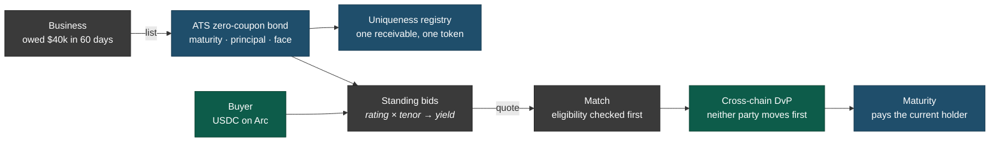
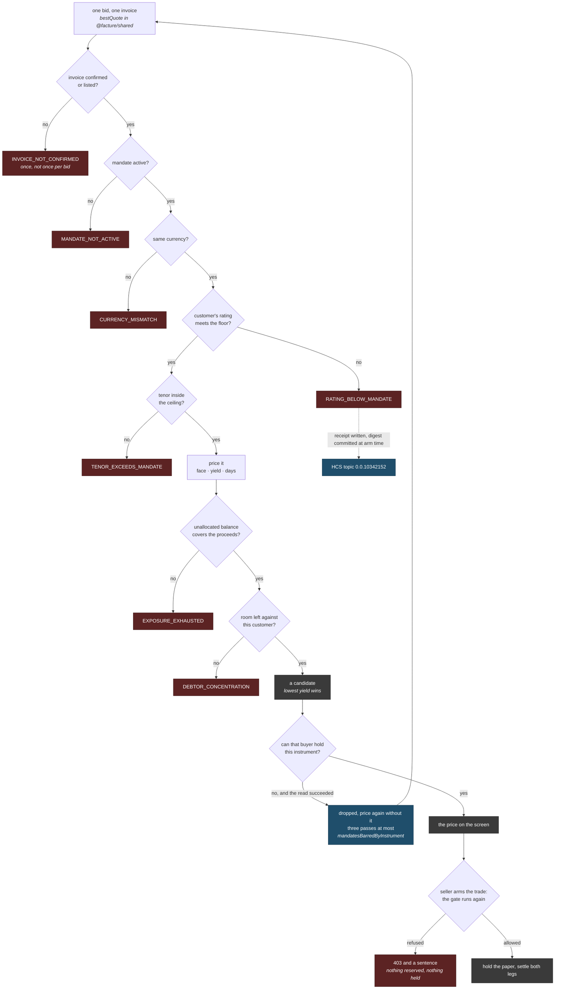

<p align="center">
  <picture>
    <source media="(prefers-color-scheme: dark)" srcset="packages/web/public/logo-dark.svg">
    
  </picture>
</p>

<h1 align="center">Facture</h1>

<p align="center">
  <strong>An invoice is a zero-coupon bond that nobody ever priced.</strong>
</p>

<p align="center">
  Hedera &middot; Arc &middot; ATS zero-coupon paper &middot; cross-chain DvP over x402
</p>

<p align="center">
  <a href="https://github.com/jagnani73/facture/actions/workflows/ci.yml"></a>
  <a href="https://facture-ethonline.vercel.app"></a>
  <a href="https://hashscan.io/testnet/contract/0x8eb9f00126bca50226e47b71a75f7b438e81d408"></a>
  <a href="./LICENSE"></a>
</p>

---

Built for [ETHOnline 2026](https://ethglobal.com/events/ethonline) on the from-scratch track, so no
project-specific code predates the event and the commit history is there to show the work.

|            |                                                                                                                                                                                                                                                                                                                                                                                         |
| ---------- | --------------------------------------------------------------------------------------------------------------------------------------------------------------------------------------------------------------------------------------------------------------------------------------------------------------------------------------------------------------------------------------- |
| **Try it** | [the seller's book](https://facture-ethonline.vercel.app/book) &middot; [standing bids](https://facture-ethonline.vercel.app/mandates) &middot; [a trade proved end to end](https://facture-ethonline.vercel.app/proof/3d129208-a99e-4667-bc4a-1d7bc5a537eb) &middot; [one an agent bought for itself](https://facture-ethonline.vercel.app/proof/c0c8ed97-b01d-4c30-b9b2-0ddf7472fa3d) |
| **Venue**  | <https://facture-backend-4p7y.onrender.com> and [`/health`](https://facture-backend-4p7y.onrender.com/health), which reports each chain as reachable, unreachable, or not yet asked                                                                                                                                                                                                     |
| **Read**   | [four architecture diagrams](./docs/architecture.md) &middot; [every transaction, with ids to check them](./docs/deployments.md) &middot; [a thirteen-minute demo](./docs/demo.md) &middot; [a hands-on walkthrough](./docs/walkthrough.md) &middot; [which parts a model wrote](./docs/ai-usage.md)                                                                                    |

<sub>The venue is a free Render instance and sleeps after fifteen idle minutes, so the first request
after a quiet spell waits about fifty seconds while it wakes. It has no persistent disk either: the
book ships as a snapshot inside the build, and whatever you do to the hosted copy is gone at the
next deploy. A local venue keeps it.</sub>

> **Status: running on testnet.** Each of the five moves below has happened on chain, more than once.
> A receivable was issued as an ATS zero-coupon bond, priced off a standing mandate, checked against
> the security's own control list, settled delivery-versus-payment, and matured at par to its holder.
> The transactions behind each of those are in [docs/deployments.md](./docs/deployments.md), which
> exists so that every claim on this page can be checked somewhere that is not us.
>
> It is a hackathon build on testnets, with a seeded demo book behind it. The cash leg runs on two
> rails: a funded mandate settles out of its Arc escrow in USDC, an unfunded one over x402 on Hedera
> in HBAR under a declared scale. Both have carried live trades. Where a section below describes
> something the build does not have, it says so in place.

Factoring is bond pricing done over the phone. A business that is owed money and needs it now calls a
factor, the factor prices the paper privately, and the business gives up 2&ndash;5% of the face value
for not waiting. No screen, no curve, no second buyer.

Facture is the market that should exist instead.

## Why this exists

Invoice finance never grew a market for a reason that is neither regulatory nor custodial. Invoices
are not fungible. Every receivable has a different debtor, a different amount and a different number
of days left, so no two are the same asset, and an order book needs something that repeats.

Price therefore stays bilateral. It gets negotiated once, in private, by whoever picked up the phone.

The move is to stop standardising the paper and standardise the bid. A buyer does not offer on one
invoice. They post a standing quote over a bucket:

> _Any A-rated paper, 60 days or less, at 12.5% annualised, up to $200k of exposure._

The assets stay unique and the buyers become fungible. Any receivable that arrives is priced by
reading the curve at its own rating and tenor, and nobody waits for a counterparty because the
counterparties were already there.

### The instrument was always a bond

A discounted invoice is a zero-coupon bond. Bought below par, redeemed at face on a fixed date, the
discount being the yield. That is the same instrument, not a comparison to one.

Hedera's [Asset Tokenization Studio](https://github.com/hashgraph/asset-tokenization-studio) agrees,
if you read it that way. `deployBond` initialises every bond at `rate: 0`, carrying a maturity date,
a principal and a face value redeemed at maturity. The default case in ATS is a discounted
receivable. The docs just do not call it one.

## How it works

Five moves. The paper lives on Hedera, the money lives on Arc, and neither travels.



### List

The receivable is issued as an ATS zero-coupon bond, with maturity the invoice due date and principal
the face value. That happens at onboarding rather than at sale. Twenty invoices is twenty
seven-million-gas transactions and Hedera throttles on network gas throughput, so issuance queues and
paces itself, and the book shows an invoice as being added until its instrument exists. Nobody is
waiting on it, which is the point of doing it early.

A uniqueness registry keyed on `hash(debtor, invoice number, amount)` means one receivable mints
exactly one token, ever. Selling the same receivable to three financiers is the fraud factoring has
always had, and roughly what broke Greensill. A registry cannot make an invoice real. It can stop it
being sold twice.

Two things enforce that, and they answer different questions. A unique index on the hash, written in
the statement that creates the invoice, closes the check-then-insert window inside this venue.
[`UniquenessRegistry`](https://hashscan.io/testnet/contract/0x8eb9f00126bca50226e47b71a75f7b438e81d408)
on Hedera is checked before an invoice is listed and claimed once its instrument exists, which is the
half a database cannot do: the second financier is a different company, not a second row in the first
one's table. It is append-only and has no release, so a non-zero answer is a permanent public
statement that a receivable is spoken for.

That has been tested the only way it means anything. A receivable this venue holds no row for was
claimed on chain by another instrument, and listing it came back 409. Nothing local could have
refused it.

If the registry cannot be reached, listing proceeds on the index alone. That is a real reduction in
strength, and the alternative is one RPC outage stopping a business from listing an invoice.

### Quote

Bids are standing rather than per-asset. Each carries a rating floor, a maximum tenor, an annualised
yield and an exposure ceiling, which is how money-market desks have always quoted short paper. A new
invoice is priced by reading the curve where it sits.

A quote is worth something only if it is firm, so the capital behind a bid has to be committed rather
than merely permitted. Funding is what does that. A mandate can match only up to its unallocated
balance, which makes overcommitment structurally impossible instead of policed.

### Match

Eligibility is checked against the security's own `ControlList` and `Kyc` facets before matching, not
at settlement. That ordering is the argument. An AMM matches first and finds out afterwards that the
transfer is illegal, so a non-compliant trade surfaces as a revert. Here an ineligible counterparty
is never matched at all, and the refusal is an output of the system rather than a failure of it.

Every refusal is stored with its reason code and its sentence, then committed to Hedera Consensus
Service topic [`0.0.10342152`](https://hashscan.io/testnet/topic/0.0.10342152). What goes on the topic
is a hash, never the reason. A refusal names the customer and the amounts, and a topic is public, so
publishing one would broadcast a buyer's exposure and a seller's customer list to anyone reading. The
message carries a SHA-256 commitment and an opaque receipt id instead. You hold the receipt, you hash
it the same way, and you check it against the digest at your sequence number. We cannot later claim
we gave you a different reason, and a stranger watching the topic learns only that a refusal
happened.

Consensus attaches after the receipt is written, so a topic that is down costs the independently
checkable copy rather than the answer itself.

### Settle

Delivery versus payment across two chains, with no bridge. The bond stays on Hedera, the USDC stays
on Arc, and neither side has to move first. This reads x402 as a settlement protocol rather than an
API paywall: the challenge holds the asset leg, the payment signature is the cash leg, and the
facilitator makes the two simultaneous. Nothing is wrapped and nothing crosses.

The reason for two chains is not that it is clever. Buyer capital already lives where stablecoins
live, and nobody asks a treasury desk to bridge onto Hedera to buy a $40k receivable.

The mandate picks the rail. A bid whose capital is escrowed in `MandateVault` settles out of it, in
USDC on Arc, and `POST /v1/trades` answers 200 with both legs already done. There is no challenge to
sign, because a funded mandate has already agreed to anything meeting its terms, which is what a firm
bid means. An unfunded bid gets the x402 exchange instead. Both answers name the rail and the reason,
so nothing about which one ran has to be inferred.

Nine receivables have sold on chain. Six took payment over x402 on `hedera:testnet` in HBAR, and
three were paid in USDC out of the Arc vault, which one buyer funded from their own wallet. One of
the x402 sales was made by `@facture/agent` rather than by a person: it read the book, priced it
against its own mandate, armed the trade, signed the cash leg with the buyer's Hedera key, and
settled. The buyer paid the tinybars it was quoted and no gas at all, because the payload's
transaction id is generated against the facilitator's account. Nothing about that invoice was
arranged for it. Its customer is unrated, which loses five of the seven mandates before a price is
computed, a sixth caps tenor at 45 days against a 47-day invoice, and the one bid left holds no vault
capital, so the venue routed it to x402 by arithmetic rather than by configuration.

Two things there are worth stating, because both surprised us. The seller claims their own payout:
`DvpEscrow.claim` requires `msg.sender == beneficiary`, so the money lands in a lock rather than a
wallet, and Arc gas is USDC, which means a seller holding none can be paid and still be unable to
collect. And on the vault rail the cash commits before the paper moves, with the invoice marked sold
at the payout rather than at the delivery. Reverse those two and a failed delivery leaves the buyer
holding paper nobody paid for, which nothing recovers. It took a double-spend found in review to see
it.

Every figure behind those trades, down to the balances either side, is in
[docs/deployments.md](./docs/deployments.md).

### Mature

The debtor pays, and settlement routes to whoever holds the token now rather than whoever bought it
first. Without that the paper cannot legitimately change hands, because a second buyer would have no
way to be paid.

The mechanism follows from a decision made elsewhere on this page. The debtor has no wallet, because
confirmation is a link with one sentence and two buttons, and a key to manage would undo that. So the
payout cannot be a transfer the debtor signs. It is drawn instead on a collection account the venue
operates, which is how a factoring house already collects and disburses.

Maturity therefore produces an obligation rather than a payment. It writes a Hedera Scheduled
Transaction paying face value to the current holder and leaves it unsigned on the ledger, where that
holder can read it. Signing it is a separate act, the venue's statement that the debtor's money
actually arrived, and only then is there a receipt. The two cannot quietly collapse into one, because
the account being debited is deliberately not the account that creates the schedule.

## The product

Nobody using Facture needs to know it is on a blockchain. A seller sees invoices with prices beside
them; a buyer sees mandates, exposure and yield. Every primitive here already has a plain financial
name, so that is the name it gets. The chains surface in one place: a proof view, one click from any
trade, carrying the on-chain receipts, the compliance decision and both settlement legs.

### Confirmation

An invoice is grey until the customer confirms it. They get a link carrying one
sentence, _Meridian Fabrication says you owe them $40,000, due 30 November. Is that right?_, and two
buttons. No wallet, no signup. This works where attestation schemes usually do not, for a behavioural
reason rather than a cryptographic one: the debtor is not being asked to vouch for a stranger, but to
acknowledge their own accounts payable, which costs them nothing and which they have no incentive to
deny.

That answer is recorded on
[`InvoiceRegistry`](https://hashscan.io/testnet/contract/0x44fe6E29aaDe69085CE53c4694b99EFe4639B7a7),
where `isConfirmed(invoiceId)` is a public view, so the fact that justifies advancing the full face
value is checkable without trusting us. The contract cannot express a confirmation at listing, since
`list` always writes `Draft`, which means a confirmation the customer never gave is not something the
venue can assert by setting one field.

### The price is already there

A confirmed invoice carries a live number, not a button that requests
one, and it moves as the curve moves and as the due date approaches.

> **$40,000** &middot; due in 60 days &middot; worth **$39,178** today
> 12.5% annualised &middot; three mandates would take this

Every other screen exists to make that screen true. Face $40,000 over sixty days at 12.5% is a
discount of $821.92 and proceeds of $39,178.08, which is 2.05% of face against the 2&ndash;5% the
same seller pays a factoring house today. Offering it is the seller's own act: a confirmed invoice is
priced, a listed one is for sale, and arming a trade refuses anything not listed.

### Buyers do not browse

A funder writes a mandate, funds it and walks away. That is how credit desks
already work, where the job is portfolio policy rather than deal-by-deal underwriting. Standing
mandates are not a workaround for the missing order book. They are the right instrument for paper
that will never be fungible.

### Exit

Seasoned paper is shorter-tenor paper, so an invoice sold at 4% on day zero lists into the
same bids on day thirty and clears tighter. Primary and secondary run through one book, and that is
what makes the primary quote competitive: buyers bid tighter on paper they know they can exit. Half
of this is built. A holder can relist, and it prices off the same standing bids with no new code,
because the quote engine never reads a seller. Partial position sales are not built, so an exit today
is all or nothing, and the venue can only resell for a holder whose key it holds, which it refuses at
listing rather than failing later.

### Ratings are earned

A customer starts unrated and their first invoice prices at the wide end of
the curve. Every invoice they pay on time tightens it, permanently and visibly. There is no external
source of truth for SME debtor credit, no feed that says whether a given customer is good for $40,000
in sixty days, so a market in this paper either manufactures its own record or prices blind. Real
factoring houses do the same, and the debtor book is their moat. The cost is a genuine cold start,
stated rather than hidden.

### Non-recourse, and no holdback

A mandate is written against the customer's rating, so the risk
being priced is the customer's and the buyer carries the loss. Pricing on debtor quality and then
handing the loss back to the seller would be incoherent. It is also a full advance. Conventional
factoring holds back ten to twenty per cent until the debtor settles, and what that holdback covers
is dispute risk, which confirmation has already removed. When a customer does default the buyer takes
the loss, and that customer's rating takes a permanent mark which widens their curve for every seller
afterwards.

### The refusal

A mandate that is not eligible for an instrument does not match, and the funder is
told why in words rather than by a reverted transaction. The first one this venue produced for real,
against the tightest bid in the book:

> Cordell Credit Partners is not permitted to hold this security by its control list.

That arrived as a 403 with the sentence attached. Nothing was reserved, nothing was held, nothing
moved.

## How a bid gets refused

Every mandate on the book is screened against the invoice, and a screen that fails produces a
sentence rather than silence.



The last two forks are the ones worth reading twice, because neither produces a refusal code. When an
instrument's own control list bars a buyer, the bid did not decline the paper. The paper declined the
bid, and `@facture/shared` has no word for that because the contracts do not either. It comes back as
a count, `mandatesBarredByInstrument`, and at arm time as a 403 carrying a sentence.

The qualifier on that fork carries weight too. A bid is dropped when the instrument answers no, and
kept when the instrument cannot be asked, because an indeterminate answer must not move a price. A
relay outage would otherwise drop the three tightest bids on every invoice and quietly widen the
whole curve. Arming refuses on the unknown, since money must not move on one, and the asymmetry is
deliberate.

Two codes in the vocabulary are never produced by the running venue. `NOT_KYC_VERIFIED` is spelled in
`AtsComplianceGate.sol`, and `INELIGIBLE_JURISDICTION` describes a question this venue does not
decide, because Reg S scope lives on the instrument. Both stay in the union so that a refusal a
funder reads is spelled the same wherever it came from.

The tree carries no clock. Refusals are computed on every quote and returned for the screen, while
the stored receipt and its HCS digest are written when a seller actually arms a trade, so a price
nobody acted on leaves no permanent record of who declined it.

## Architecture

Five packages, two chains, and exactly one moment where a person is asked to sign something.
[docs/architecture.md](./docs/architecture.md) has four diagrams: the pieces, the path a receivable
takes through them, how the cash leg picks a rail, and the lifecycle a status follows.

Two things those diagrams cannot show. `@facture/contracts` is a Hardhat workspace and no package
imports it, because every ABI the backend calls is written out beside the call, so nothing in the
build ties the TypeScript to the Solidity. The one thread between them is a test in `@facture/agent`
that reads `ReasonCodes.sol` off disk and fails if the on-chain refusal strings stop spelling what
`@facture/shared` spells, since `tsc` cannot see a Solidity rename.

The other is the contract they grey out. The Hedera `DvpEscrow` is deployed, verified and
deliberately unreached. Its only designed reader wants a claimed delivery lock, and this venue's
asset leg is an ATS hold, where the units never leave the holder's ledger entry. Producing the
escrow's proof instead would mean moving a regulated security into a contract that sits on no
instrument's allowlist. The reasoning is in `CLAUDE.md`, under _Declined: the Hedera delivery
escrow_.

### One bond per invoice is affordable, and that was measured

`Factory.deployBond` cost 7,016,307 gas for the first bond this project issued, then 7,024,576 and
7,023,179 for the two the venue went on to issue by itself. That is about 47% of Hedera's 15M
per-transaction ceiling, inside the 6,956,443 to 7,310,717 range read off 24 historical calls to the
deployed factory, and 7.3 to 8.9 HBAR an issuance. Ninety-four facets initialise inside that one
transaction, so the count would have to almost double before the ceiling binds. Live operations are
cheap beside it: a role grant is 180k, a KYC grant 190k, a mint 465k, a transfer 254k warm.

The thesis depends on those numbers. Pooling receivables into one facility would make the assets
fungible again and collapse this into ordinary securitisation, so heterogeneous per-invoice paper has
to be affordable rather than merely preferable.

## What this does not claim

- **Six of the seven seeded mandates quote against capital nobody posted.** One is backed, with real
  USDC deposited by that buyer's own wallet, and funding is checked against what the vault actually
  holds. The check stops that growing rather than undoing it, and the demo book says which is which.
- **Circle enforces no spending cap on this path.** Spending policies are a mainnet Agent Wallets
  feature, Arc has no mainnet identifier there, and developer-controlled wallets have no policy
  engine at all. The cap is the mandate's, enforced by the agent and again by the venue when a trade
  is armed. A cap we wrote, described as a cap the custodian holds, would be fake liquidity one layer
  down.
- **Cash-out rails stop at the seller's claim**, and are out of scope rather than mocked.
- **`MandateVault.reclaimPayout` has no caller.** It is the permissionless call that returns a
  stranded lock's capital to its mandate, and making it is an operator action today.

## Prior art

Two projects sit close enough that they should be named rather than hoped over.

**[Mand(ate)](https://ethglobal.com/showcase/mand-ate-3npu6)** built AI-driven invoice escrow where
agents negotiate terms bilaterally. That is the opposite mechanism on the same market: the argument
here is that bilateral negotiation is the problem, and a standing-bid book that quotes before anyone
asks is the alternative.

**[Wafer](https://ethglobal.com/showcase/wafer-r4uab)** won Hedera's tokenization track at ETHGlobal
New York 2026 with a NAV-appreciating credit fund and a secondary market on SaucerSwap. The
distinction is the one drawn under _Match_: an AMM cannot enforce compliance at the point of trade,
because it has no point of trade at which to ask.

# For developers

## Repo layout

A pnpm workspace of five packages, kept separable so anything on the cut list detaches without
surgery.

| package              | what it holds                                                                                         |
| -------------------- | ----------------------------------------------------------------------------------------------------- |
| `@facture/web`       | Next.js 15, React 19, Tailwind. Eight routes: the book, mandates, the proof view, the debtor's page.  |
| `@facture/backend`   | Hono over SQLite and drizzle. Quote engine, settlement on both rails, issuance queue, compliance.     |
| `@facture/shared`    | The curve, both state machines, the refusal vocabulary, ISIN generation, the uniqueness hash.         |
| `@facture/agent`     | The market maker. Reads the book, prices it against its own mandate, arms a trade and pays for it.    |
| `@facture/contracts` | Hardhat 3. Eight contracts across Hedera and Arc, verified on Sourcify, imported by no other package. |

Each package has a README covering its own seams. `docs/` holds the four files written to be checked
rather than believed, and `CLAUDE.md` is the working record underneath all of it: every constraint
that cost a day to find, and what was decided after it.

## Run it

Node 22.15 or newer, pnpm 11.

```bash
pnpm install
pnpm --filter @facture/shared build   # dist/ is gitignored and every workspace import resolves through it

pnpm --filter @facture/backend dev    # the venue,   :8787
pnpm --filter @facture/web dev        # the screens, :3000
```

The screens run with no backend at all: leave `NEXT_PUBLIC_API_BASE_URL` unset and they render the
fixture book, which is fiction end to end and says so on the page. Pointing them at a running venue
needs a seller and a buyer id, because every route is scoped by one. Each package carries a
`.env.example` naming what it wants. Nothing that only reads needs a key; the keys are for issuing,
settling and deploying.

[docs/walkthrough.md](./docs/walkthrough.md) goes from an empty book to a matured receivable and
says in place which steps spend testnet money.

## Tests

```bash
pnpm test        # more than 1,500 across the five packages
pnpm lint
pnpm typecheck
```

The contract suite is Hardhat's and the rest are vitest. `pnpm typecheck` wants two builds ahead of
it: `@facture/shared` because its `dist/` is gitignored, and `@facture/contracts` because its test
types come from the compiled artifacts. That is the order the CI workflow runs in, and without them
a clean checkout fails `tsc --noEmit` with an error about the test rather than the missing build.

The web suite is component and unit only, with no browser harness, deliberately. What it guards is
the class `tsc --noEmit` cannot see: a decoder reading the wrong field is well typed.

## Deployed

| what          | where                                                                                                                                                                                                    |
| ------------- | -------------------------------------------------------------------------------------------------------------------------------------------------------------------------------------------------------- |
| the screens   | Vercel. `vercel.json` builds `@facture/shared` before Next and filters the install to the web package, which keeps Hardhat and a native SQLite build out of a frontend deploy that needs neither.        |
| the venue     | Render, free tier. No persistent disk, so `data/facture.snapshot.db` ships inside the build and a deploy resets the demo to a known state rather than accumulating half-finished trades.                 |
| the contracts | `deploy:hedera` and `deploy:arc` in `@facture/contracts`, then `verify`, which publishes to Sourcify, and that lookup is what lights HashScan's badge. Addresses are pinned in `@facture/shared/chains`. |

## Tech

Hedera testnet carries the paper: Asset Tokenization Studio for the bonds, Consensus Service for
refusal and match digests, a Scheduled Transaction for the maturity payout, the mirror node for
every read the compliance gate makes. Arc testnet carries the money as USDC, where gas is USDC too.
The cash leg is x402 v2 through the Blocky402 facilitator on one rail and the Arc escrow on the
other. Privy signs sellers in by email and holds the key that claims a payout; Circle's
developer-controlled wallets fund a mandate's escrow. Everything above that is TypeScript: Hono, drizzle,
Next, viem, vitest, Hardhat.

## Licence
