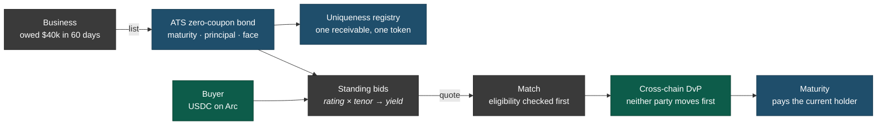

<h1 align="center">Facture</h1>

  <strong>An invoice is a zero-coupon bond that nobody ever priced.</strong>

  Hedera &middot; Arc &middot; ATS zero-coupon paper &middot; cross-chain DvP over x402

---

> **Status: pre-build.** Nothing is deployed. There are no contract addresses, no demo, and no CI.
> This README is the design as it stood going into [ETHOnline 2026](https://ethglobal.com/events/ethonline2026),
> and it will be rewritten as things land. Sections describing behaviour are describing intent, not
> something you can go and use.

Factoring is bond pricing done over the phone. A business that is owed money and needs it now calls
a factor, the factor prices the paper privately, and the business takes 2&ndash;5% off the face value
for the privilege of not waiting. There is no screen, no curve, and no second buyer.

Facture is the market that should exist instead.

## Why this exists

The reason invoice finance never developed a market is not regulation and not custody. It is that
**invoices are not fungible.** Every receivable is a different debtor, a different amount and a
different number of days to maturity, so no two are the same asset. An order book needs something to
book, and there is nothing here that repeats.

So price stays bilateral. It gets negotiated once, in private, by whoever picked up the phone.

The move is to stop trying to standardise the paper and **standardise the bid instead.** A buyer does
not post an offer for one invoice; they post a standing quote over a bucket:

> _Any A-rated paper, 60 days or less, at 12.5% annualised, up to $200k of exposure._

Now the assets stay unique and the **buyers** become fungible. Any receivable that arrives is priced
immediately by reading the curve at its own rating and tenor. Nobody waits for a counterparty,
because the counterparties were already there.

### The instrument was always a bond

This only works if a receivable can be described honestly as a tradeable instrument, and it can. A
discounted invoice is a zero-coupon bond: bought below par, redeeming at face on a fixed date, with
the discount being the yield. That is not a metaphor, it is the same instrument.

Hedera's [Asset Tokenization Studio](https://github.com/hashgraph/asset-tokenization-studio) turns
out to agree. `deployBond` initialises every bond at `rate: 0`, carrying a maturity date, a principal
and a face value redeemed at maturity. The default case in ATS is already a discounted receivable; it
just isn't described that way in the docs.

## How it works

Five moves. The paper lives on Hedera, the money lives on Arc, and neither has to travel.

### List

The receivable is issued as an ATS zero-coupon bond. Maturity is the invoice due date, principal is
the face value.

Alongside it, a uniqueness registry keyed on `hash(debtor, invoice_no, amount)` means one receivable
mints exactly one token, ever. That is the cheap half of the fraud problem and it is worth doing on
day one: selling the same receivable to three financiers is the specific fraud that factoring has
always had, and it is roughly what broke Greensill. A registry does not make an invoice real, but it
stops it being sold twice.

### Quote

Bids are standing, not per-asset. They carry a rating floor, a maximum tenor, an annualised yield and
an exposure ceiling, which is how money-market desks have always quoted short paper. A new invoice is
priced by reading the curve where it sits.

A quote is only worth something if it is firm, which means the capital behind a bid has to be
committed rather than merely permitted. This is unresolved &mdash; see below.

### Match

Eligibility is checked against the security's own `ControlList` and `Kyc` facets **before** matching,
not at settlement.

That ordering is the whole argument. An AMM matches first and discovers the transfer is illegal
afterwards, so a non-compliant trade shows up as a revert. Here an ineligible counterparty is never
matched in the first place, and the refusal is a first-class output rather than a failed transaction.
Every refusal writes a receipt to HCS that the rejected party can check without trusting us.

### Settle

Delivery versus payment across two chains, without a bridge. The bond stays on Hedera, the USDC stays
on Arc, and neither side has to move first.

This reads x402 as a settlement protocol rather than an API paywall: the challenge holds the asset
leg, the payment signature is the cash leg, and the facilitator is what makes the two simultaneous.
Nothing is wrapped and nothing crosses.

The honest reason for two chains is not that it is clever. It is that **buyer capital already lives
where stablecoins live.** You do not ask a treasury desk to bridge onto Hedera to buy a $40k
receivable. DvP means it never has to.

### Mature

The debtor pays and scheduled settlement routes to whoever holds the token **now**, not whoever
bought it first.

This is not a lifecycle nicety. Without it the paper cannot legitimately change hands, because a
second buyer would have no way to be paid &mdash; so it is load-bearing for the claim that this is a
secondary market at all.

## One book, two lives

Seasoned paper is just shorter-tenor paper, so an invoice sold at 4% on day zero lists into the same
bids on day thirty and clears tighter because less time remains. Primary and secondary run through
one book, and the price moves for a reason anyone can follow.

That is not one market counted twice, and the argument is under _Exit_ below: a buyer bids tighter on
paper they know they can exit, so the secondary leg is what makes the primary quote competitive.
Partial position sales sharpen the distinction further, being something the primary leg structurally
cannot do.

## The product

Nobody using Facture needs to know it is on a blockchain. A seller sees invoices with prices beside
them. A buyer sees mandates, exposure and yield. Every primitive here already has a plain financial
name, so that is the name it is given.

The chains surface in exactly one place: a proof view, one click from any trade, showing the on-chain
receipts, the compliance decision and both settlement legs.

### The book

A seller connects a wallet, or has one made from an email address, and adds their outstanding
invoices: customer, amount, invoice number, due date.

Each invoice becomes an instrument at this moment, not at the moment of sale. That ordering matters
more than it looks. Tokenisation happens at onboarding, when nobody is watching a clock, so issuance
is never on the critical path of the moment money moves.

### Confirmation

An invoice is grey until the customer confirms it. The seller requests confirmation and the customer
receives a link carrying one sentence &mdash; _Meridian Fabrication says you owe them $40,000, due 30
November. Is that right?_ &mdash; and two buttons. No wallet, no signup.

This works where most attestation schemes do not, and the reason is behavioural rather than
cryptographic. The debtor is not being asked to vouch for a stranger. They are being asked to
acknowledge their own accounts payable, which costs them nothing and which they have no incentive to
deny.

The invoice turns green. Now it has a price.

### The quote is already there

A confirmed invoice carries a live price. Not a button that requests one: the number is simply
present, and it moves as the curve moves and as the due date approaches.

> **$40,000** &middot; due in 60 days &middot; worth **$39,178** today
> 12.5% annualised &middot; three mandates would take this

This is the product. Every other screen exists to make this screen true. Nothing in invoice finance
works this way today, where a price is a phone call and a wait.

### The sale

Face $40,000, sixty days, 12.5% annualised, discount $821.92, proceeds $39,178.08 &mdash; 2.05% of
face, against the 2&ndash;5% the same seller pays a factoring house today. Confirm, and it settles in seconds
against the best mandate that accepts this customer, accepts this tenor, and has exposure left.

### Buyers do not browse

A funder never scrolls through invoices deciding one at a time. They write a mandate &mdash; _any
invoice, customer rated A or better, ninety days or less, at 12.5% annualised, up to $200,000 total
and $50,000 per customer_ &mdash; fund it, and walk away.

Funding is what makes the quote firm, which is the answer to what a standing bid actually commits. A
mandate can only match up to its unallocated balance, so overcommitment has a structural answer
rather than a patch.

This is also how credit desks already work. The job is portfolio policy, not deal-by-deal
underwriting. Standing mandates are not a workaround for the absence of an order book; they are the
correct instrument for paper that will never be fungible.

### Exit

On day thirty a holder lists back into the same book and clears tighter, keeping the carry they
earned, or sells half the position and keeps the rest.

The reason this is not decoration: buyers bid tighter on paper they know they can exit. Remove the
secondary leg and every mandate widens, and the seller gets less on day zero. The two markets are not
sequential features. One prices the other.

### Ratings are earned, not assigned

A customer starts unrated, and their first invoice prices at the wide end of the curve. Every invoice
they pay on time tightens it, permanently and visibly.

This is not a preference between two viable options. No external source of truth exists for SME
debtor credit &mdash; there is no feed, oracle or otherwise, that says whether a given customer is
good for $40,000 in sixty days &mdash; so a market in this paper has to manufacture its own record or
price blind. It is also what real factoring houses do, where the proprietary debtor book is the moat.
The cost is a genuine cold start, stated rather than hidden. A seller's
customers becoming an asset the seller owns is the compounding argument for the whole thing.

### Issuance is paced, not instant

A seller adding twenty invoices is twenty seven-million-gas transactions. Hedera throttles on network
gas throughput as well as per-transaction gas, so a burst of those will start returning `BUSY` long
before any single one is refused. Onboarding therefore queues and paces issuance, and the book shows
an invoice as _being added_ until its instrument exists.

This costs nothing, because issuance was already moved off the critical path. Nobody is waiting on it
&mdash; the seller added invoices, and they become quotable as they land.

### Non-recourse, and why there is no holdback

Facture is a non-recourse market, and that is not a preference &mdash; it follows from the pricing. A
mandate is written against the _customer's_ rating, so the risk being priced is the customer's, which
means the buyer carries the loss if the customer does not pay. Pricing on debtor quality and then
handing the loss back to the seller would be incoherent.

It is also a **full advance**. Conventional factoring holds back ten to twenty per cent until the
debtor settles, because the invoice might be disputed, short-paid or already partly satisfied. That
holdback exists to cover dispute risk &mdash; and debtor confirmation removes dispute risk at the
point of listing, because the customer has already acknowledged the amount and the date. Confirmation
is what buys the seller the other fifteen per cent, on the day they sell.

When a customer does default, the buyer takes the loss and that customer's rating takes a permanent
mark, which widens their curve for every seller afterwards. That is the loop that makes an earned
rating self-correcting rather than merely accumulated: the market prices its own mistakes back in.

### The refusal

A mandate that is not eligible for an instrument does not match, and the funder is told why in words
rather than by a reverted transaction &mdash; _this invoice is restricted to buyers verified under
Reg D 506(c), and your mandate is not_ &mdash; with a receipt they can check without trusting the
venue.

## What is decided, and what is not

Recorded here so they are not relitigated mid-build.

- **One bond per invoice is affordable. Measured, not assumed.** `Factory.deployBond` costs
  **6,978,091 gas** in the repo's default configuration &mdash; 47% of Hedera's 15M per-transaction
  ceiling &mdash; and 8,158,081 in the heaviest configuration that could be constructed, which is
  still only 54%. Ninety-four facets initialise in that one transaction, at roughly 74k each. The
  facet count would have to almost double before the ceiling binds. Live operations are cheap by
  comparison: a role grant is 180k, a KYC grant 190k, a mint 465k, a transfer 254k warm. Corroborated
  by the repo's own deploy scripts, which ship `gasLimit: 10_000_000` for this call on both
  `hedera-testnet` and `hedera-mainnet`, against five real dated testnet deployment records.
  Heterogeneous per-invoice paper stands.

- **What makes a bid firm.** Mandate capital is escrowed at funding. Matching is bounded by
  unallocated balance, which is also what resolves two invoices arriving against one mandate.
- **Where a rating comes from.** Earned on the platform out of settled payment behaviour, starting
  unrated. No oracle, and no invented score.
- **Whether an invoice is real.** Debtor confirmation gates listability, and a uniqueness registry
  keyed on `hash(debtor, invoice number, amount)` means one receivable mints exactly one instrument,
  ever.
- **What a seller does with the USDC.** Nothing, for now. Cash-out rails are out of scope and are
  said plainly rather than mocked.
- **Whether market-makers are visible.** They are real agents holding funded mandates on
  policy-capped wallets, and they are presented as exactly that. Fake liquidity is the one thing that
  would undo every argument above.

## Prior art

Two projects sit close enough that they should be named rather than hoped over.

**[Mand(ate)](https://ethglobal.com/showcase/mand-ate-3npu6)** built AI-driven invoice escrow where
agents negotiate terms bilaterally. That is the opposite mechanism on the same market: Facture's
argument is that bilateral negotiation is the problem, and a standing-bid book that quotes before
anyone asks is the alternative.

**[Wafer](https://ethglobal.com/showcase/wafer-r4uab)** won Hedera's tokenization track at ETHGlobal
New York 2026 with a NAV-appreciating credit fund and a secondary market on SaucerSwap. The
distinction is the one drawn under _Match_ above: an AMM cannot enforce compliance at the point of
trade, because it has no point of trade at which to ask.

## Licence

Not yet chosen.
