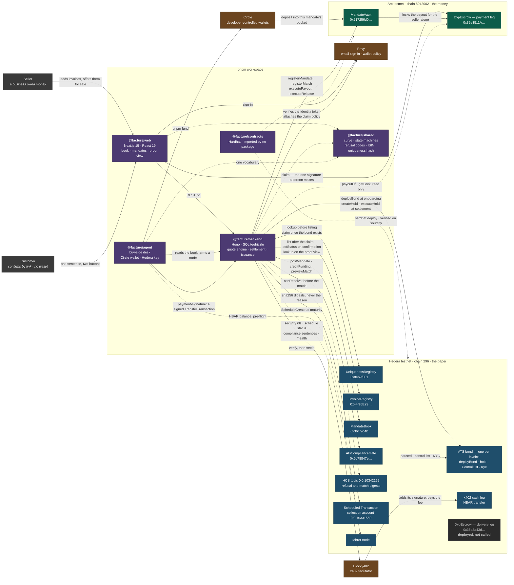
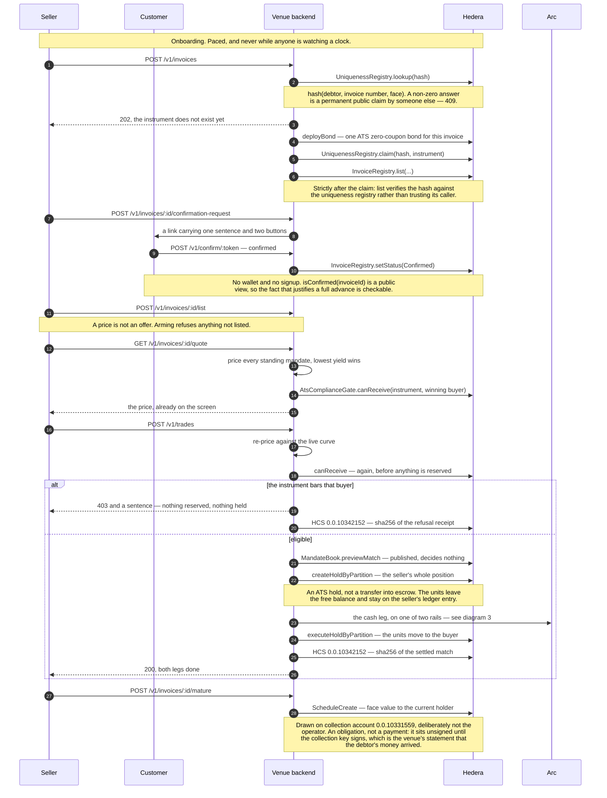
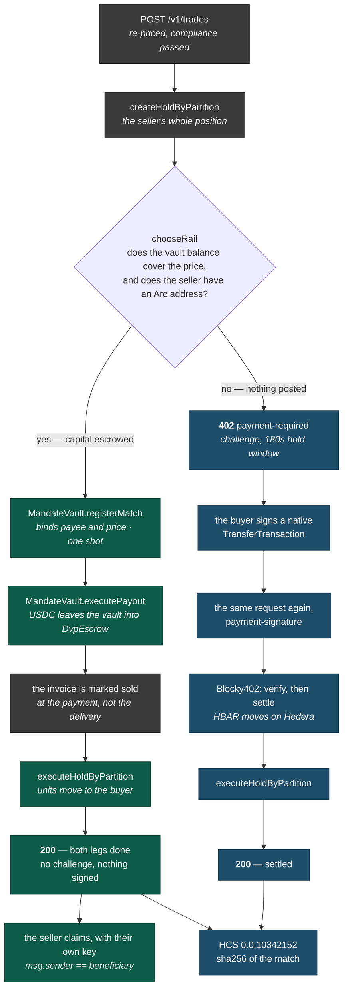
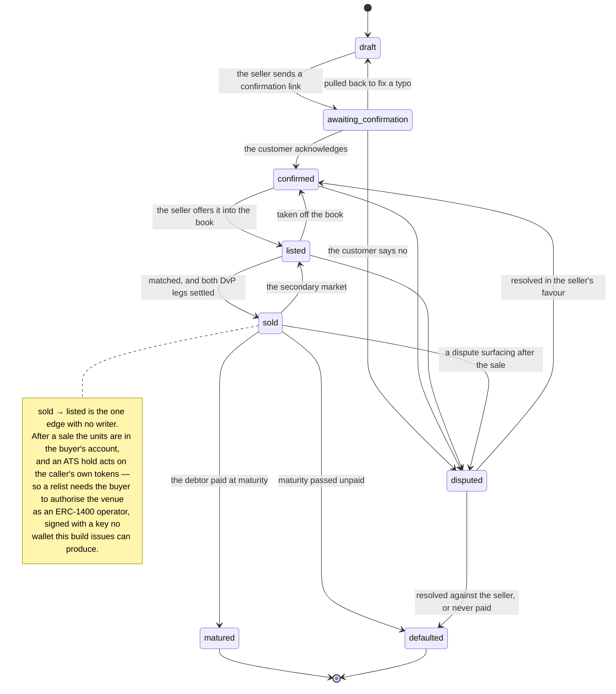

# Architecture

Facture is a market for tokenised receivables. Buyers post standing quotes over risk buckets, and
any invoice is priced off the resulting curve the moment it appears. The paper lives on Hedera as
ATS zero-coupon bonds — **one bond per invoice**, never a pool — and the cash lives on Arc as USDC.
The two settle against each other with no bridge and nothing wrapped.

Four diagrams: what the pieces are, the path a receivable takes through them, how the cash leg picks
a rail, and the lifecycle an invoice status follows. Every box and arrow is something the running
build does. Where a contract is deployed and deliberately not called, it says so in place rather
than being drawn as if it were live.

Addresses are testnet. Each one is recorded with the transactions behind it in
[deployments.md](./deployments.md), and [demo.md](./demo.md) walks the same path against the running
venue.

---

## 1. The pieces

Five packages, two chains, and exactly one moment where a person is asked to sign something.

**The frontend and the backend are separate packages and separate origins.** `@facture/web` is a
Next.js app with eight addressable routes; `@facture/backend` is a Hono service over SQLite that
holds every key the venue signs with. The web package talks to it over REST and reaches a chain
directly exactly once, to send the seller's `claim`.

**`@facture/contracts` is imported by nothing.** Every ABI the backend calls is written out beside
the call, so no build step ties the TypeScript to the Solidity. The one thread between them is a
test in `@facture/agent` that reads `libraries/ReasonCodes.sol` off disk and fails if the on-chain
refusal strings stop spelling what `@facture/shared` spells, because `tsc` cannot see a Solidity
rename.

**Six of the seven deployed contracts are in the live path.** The Hedera `DvpEscrow` is the
exception, and it is a stated position rather than a gap: its only designed reader is
`MandateBook.confirmSettlement`, and reaching it would mean moving a regulated security into an
escrow contract that would then need a control-list entry and a KYC grant on every instrument the
venue ever issues. The asset leg is an ATS hold instead, which immobilises the units without them
leaving the seller's ledger entry. The backend has no env var, no ABI entry and no code path that
can address it.

**Each dependency is off, not faked, when it is not configured.** No factory means issuance is
disabled rather than simulated; no vault address means funding is recorded rather than verified; no
topic means a refusal is recorded without a consensus copy. The one exception is the compliance
gate: with no gate address the backend reads the same three facts off the instrument's own facets
over RPC, which is a different route to the same answer rather than a relaxation.

---

## 2. The path a receivable takes

The five moves the product is built around: list, quote, match, settle, mature. Issuance sits before
all of them, at onboarding, so tokenisation is never on the critical path of the moment money moves.

**Compliance runs before the match, not at settlement.** That ordering is the argument against
doing this on an AMM: an AMM matches first and discovers the transfer was illegal afterwards, so
non-compliance arrives as a revert. Here an ineligible counterparty is never matched, and the
refusal is a 403 with a sentence.

`AtsComplianceGate.canReceive` is one `eth_call` and it is what decides. When it permits, that is the
whole check. When it refuses, the backend then reads the instrument's own facets — `paused()`,
`getControlListType()`, `isInControlList()`, `getKycStatusFor()` — because a reason code is not
something a seller can act on and a sentence is. If the gate refuses while the facets permit, the
trade is refused and marked indeterminate: settlement must not move on a contradiction, and a
contradiction is not a fact about the buyer either.

The same call runs at quote time, scoped narrowly. `priceOne` screens only the winning bid and, if
it is barred, drops it and prices the next — at most three passes, so the usual cost is one
on-chain read. `priceBook` screens nothing, deliberately: it prices the whole book in one pass, and
checking per row is the N+1 that design exists to avoid. A book price is indicative; the price a
seller acts on is screened. An **unreadable** instrument is not a refusal there, because a relay
outage would otherwise drop the tightest bids on every invoice and quietly widen the curve. Arming
refuses on the unknown, since money must not move on one.

**`MandateBook.previewMatch` is the one verdict on that path the venue cannot have arranged.** It
reads the rating, the confirmation, the due date and the face value out of `InvoiceRegistry` rather
than from the caller. It is a free `eth_call` that decides nothing and is published beside the
venue's own answer, because the book floors the discount where `@facture/shared` ceils it — so the
two legitimately differ by a minor unit on a match both would take. The reason code is the
comparable part, not the number.

**The topic carries a SHA-256 digest, never the reason.** A refusal sentence names the customer and
the amounts, and a topic is public, so publishing one would broadcast a buyer's exposure and a
seller's customer list. The refused party is handed their receipt and their sequence number and
checks the digest themselves. Settled matches are committed the same way, under a separate canonical
form. Neither publisher throws: an unavailable topic costs the independently checkable copy and
never the refusal or the trade.

---

## 3. Two cash rails, and how one is chosen

The asset leg is the same either way — an ATS hold on Hedera, executed once the cash has moved. The
cash leg has two rails and the mandate decides which, by whether its capital is already posted.

**A funded mandate settles in one call and answers 200, already settled.** There is nothing for the
buyer to sign: they escrowed the capital and wrote the terms, so an invoice meeting those terms is a
trade they have already agreed to. Asking for a second consent is what would make a standing bid not
standing. Both response bodies carry `rail.chosen` and `rail.reason`, and the receipt and the proof
view print the same thing, so which rail ran is stated rather than inferred.

**The order is chosen by which way a failure hurts.** Cash commits before the paper moves. Reverse
those two and a failed payout leaves the buyer holding paper nobody paid for, which nothing
recovers; this way a failed delivery leaves money in an escrow lock the vault gets back and the
seller keeps their position.

**The invoice is marked sold when the cash commits, not when the delivery lands.** That ordering is
a fix rather than a flourish. With no per-trade signature on this rail, a failed delivery used to
leave the invoice quotable, and a fresh quote drew a second payout from the same mandate — one
receivable paid for twice, silently. The x402 rail has the identical hole and cannot reach it,
because a second sale there needs a second signature.

**The hold windows differ because they are sized for different things.** The x402 challenge window
is 180 seconds, which is how long a buyer has to sign; the vault window is 720, which has to cover
two Arc writes and two receipt waits back to back, and is still far inside the escrow's 24-hour
payment lock.

**Both rails convert through one function.** `toSettlementAmount` in `src/units.ts` is the single
place USD cents become settlement minor units, under `X402_SETTLEMENT_SCALE_PPM`. The scale governs
both rails despite the prefix, deliberately: one receivable has to cost the same money whichever way
it settles, and a per-rail scale factor is how two rails come to quote two prices for one invoice.

**The seller claims their own payout, and that is the one signature a person makes.**
`DvpEscrow.claim` checks `msg.sender == beneficiary`, so the venue cannot collect for a seller even
while holding the public preimage. The key that can is the embedded wallet Privy made at sign-in,
scoped by a wallet policy to that one call: `to` equals the escrow, `chain_id` equals 5042002, and
the decoded calldata names `claim`. Privy denies by default, so that is the whole permission the
wallet holds. Arc gas is USDC, which means a seller holding none can be paid and be unable to
collect — `pnpm demo:reset` funds them.

`MandateVault.reclaimPayout` returns a stranded lock's capital to the mandate. It is permissionless
and **nothing in the backend calls it**; recovering a stranded lock is an operator action.

---

## 4. The invoice lifecycle

The machine lives in `@facture/shared` and the diagram below is drawn from it, not the other way
round. No transition table has been edited to match the code, deliberately: a machine edited to
agree with its callers can never catch them being wrong.

Quotability is not the same as listing. A `confirmed` invoice carries an indicative price because
the book renders in one pass with no chain reads, and that is worth keeping. Listing is the seller
offering it, and the offer binds at arm time: **arming refuses anything not listed**, and delisting
is refused while a trade is armed, so a seller cannot withdraw the offer between the 402 and the
buyer's signature.

`matured` and `defaulted` are terminal, and both feed the customer's rating, which never ages off.
The rating is earned on the platform out of settled payment behaviour, starting unrated — there is
no oracle for SME debtor credit and none is invented.

---

## Deployed contracts

All seven are verified on Sourcify, which is what lights HashScan's badge. Transactions, sizes and
the reads that confirm the wiring are in [deployments.md](./deployments.md).

| contract                   | chain        | address                                      | in the live path                                     |
| -------------------------- | ------------ | -------------------------------------------- | ---------------------------------------------------- |
| `UniquenessRegistry`       | Hedera 296   | `0x8eb9f00126bca50226e47b71a75f7b438e81d408` | yes — `lookup` before listing, `claim` after issuance |
| `InvoiceRegistry`          | Hedera 296   | `0x44fe6E29aaDe69085CE53c4694b99EFe4639B7a7` | yes — `list`, `setStatus`, `lookup`                   |
| `MandateBook`              | Hedera 296   | `0x361f9d4b1101898417b2b9148bc8aa522024a38f` | yes — `postMandate`, `creditFunding`, `previewMatch`  |
| `AtsComplianceGate`        | Hedera 296   | `0x6d78847e4ac257da68909c5a4c60ea1dcc060564` | yes — `canReceive`, at quote and again at arm         |
| `DvpEscrow` (delivery leg) | Hedera 296   | `0x35a8a43d2d840f02887cd0427e78f6b0205ded87` | **no, deliberately** — see below                      |
| `MandateVault`             | Arc 5042002  | `0x217256d0fdf83ffd81bbc6884ad44f5c02501102` | yes — the Arc cash rail                               |
| `DvpEscrow` (payment leg)  | Arc 5042002  | `0x32e3511a2f3d941f776df01f6ba66a73caf10d69` | yes — where a vault payout lands                      |

Two more Hedera objects the venue writes to, neither of them a contract: HCS topic
**`0.0.10342152`**, which carries refusal and match digests, and collection account
**`0.0.10331559`**, which pays matured receivables and is deliberately not the operator.

An earlier `AtsComplianceGate` at `0x9a2c848ab62e715d2b49a4710f6451395978abbb` is still live and
still verified. It probed three ATS selectors that do not exist on a deployed diamond and therefore
refused every buyer on every instrument. It is left in place so that an address found in an old note
can be identified rather than guessed at.

The `MandateBook` reads its own cross-chain link from immutables recorded at construction:
`cashLeg()` returns `(5042002, 0x217256d0…)`, the Arc chain id and the vault, so the link cannot be
redirected after deployment.
